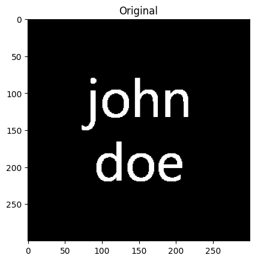
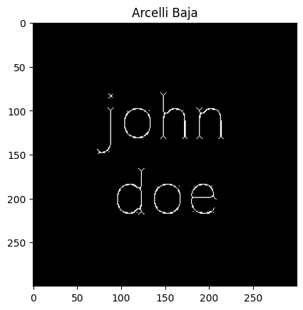
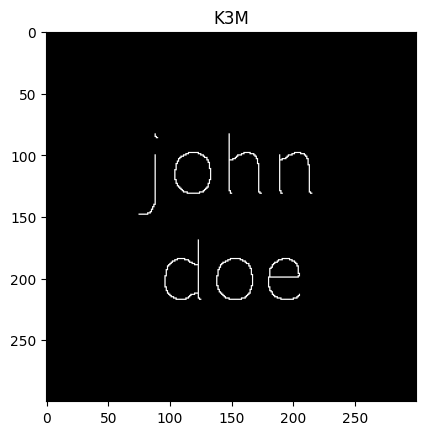
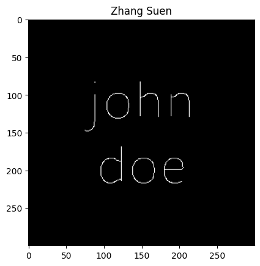

# Python implementation of thinning algorithms

## Requirements

- numpy
- scipy
- opencv-python
- matplotlib

## Usage

```bash
python src/main.py
```

## Results

|  |  |
| :---: | :---: |
|  |  |